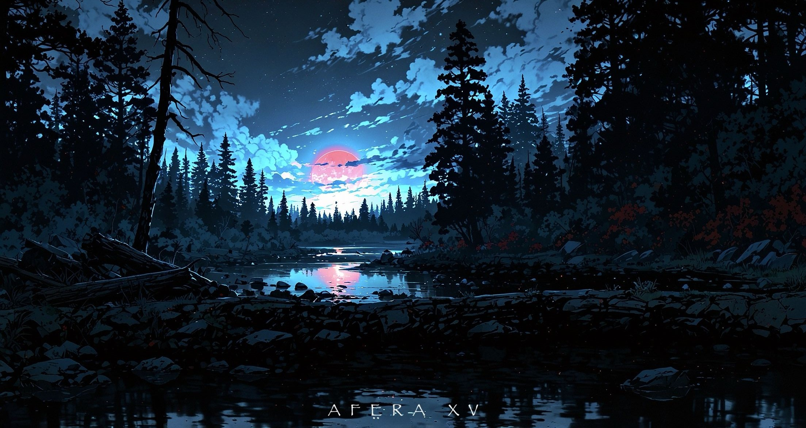

## Hi there 👋

  

###

  
  
  <a href="https://coff.ee/nehrom" target="_blank">
  

###

<h1 align="center"></h1>

###

<h3 align="left">👩‍💻  About Me</h3>

###

I'm from Ukraine 🩵💛 - 📚 I'm currently learning Rust - 🔭 I’m currently working on Majestic Web/Client API -⚡In my free time I playing the guitar

###

<h3 align="left">🛠 Languages and Tools:</h3>

 
  

 
 
 
 

 

 
 
 
 
 

 

 

###

###
